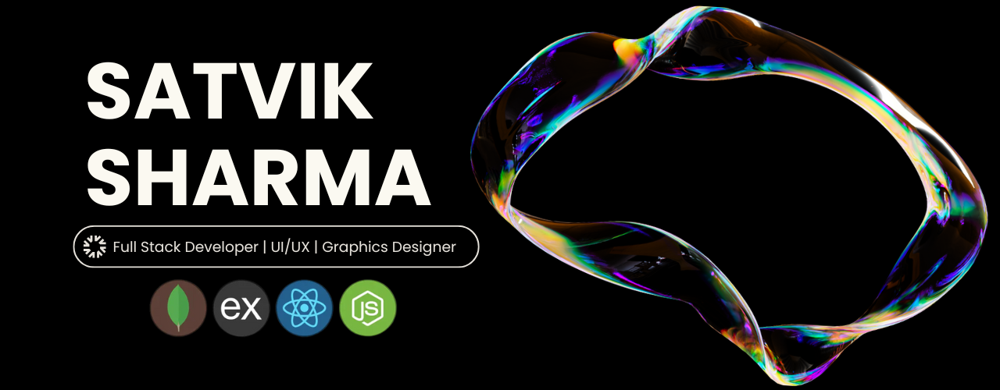

<h1 align="center">Su-swagatam 🙏 in my GitHub Universe 🚀</h1>

###

<h3 align="left">Hello, World! I'm SATVIK SHARMA  👩‍💻 A passionate Software Engineer, Web Developer, Designer who transforms ideas into beautiful solutions with a touch of creativity and logic.</h3>

###

<h3 align="left">My journey into the tech world started in 9th grade when I first discovered how software and games are created. That moment sparked a passion in me, and I knew I wanted to pursue this field and achieve something remarkable! 💻✨</h3>

###

<h3 align="left"></h3>

###

<h2 align="left">🔮 About Me</h2>

###

###

🎓 BCA Graduate from University of Lucknow  ‎‍💼 Checkout my works @ <a href="https://www.satvik-sharma.vercel.app">satvik-sharma.vercel.app</a>  🏆 Smart India Hackathon 2022 @ Finalist  💼 Former Executive @ Cogniferentials Consultancy Private Limited  🏆 Top 9.58% Coder @ Naukri Code 360  🎯 Aspiring to create intuitive experiences and scalable systems  📧 Contact me @ <a href="mailto:sharmasatvik43@gmail.com">sharmasatvik43@gmail.com</a>

###

  
  
  

###

###

<h2 align="left">🛠️ Tech Toolbox</h2>

###

<h4 align="left">Programming Languages</h4>

###

  
  
  
  
  
  
  

###

<h4 align="left">Frontend Development</h4>

###

  
  
  
  
  
  
  
  
  
  
  
  
  
  
  

###

<h4 align="left">Backend Development & API Testing</h4>

###

  
  
  
  
  
  
  
  
  
  
  

###

<h4 align="left">Database Management System</h4>

###

  
  
  

###

<h4 align="left">Cloud Platforms and Hosting</h4>

###

  
  
  
  
  
  
  
  
  

###

<h4 align="left">Containerization and Orchestration</h4>

###

  
  
  

###

<h4 align="left">Operating System & Code Editor</h4>

###

  
  
  
  
  

###

<h4 align="left">Design Tools</h4>

###

  
  
  
  
  
  
  
  
  
  
  
  
  

###

<h2 align="left">✨ Let’s Connect!</h2>

###

  
  
  
  
  

###

  

